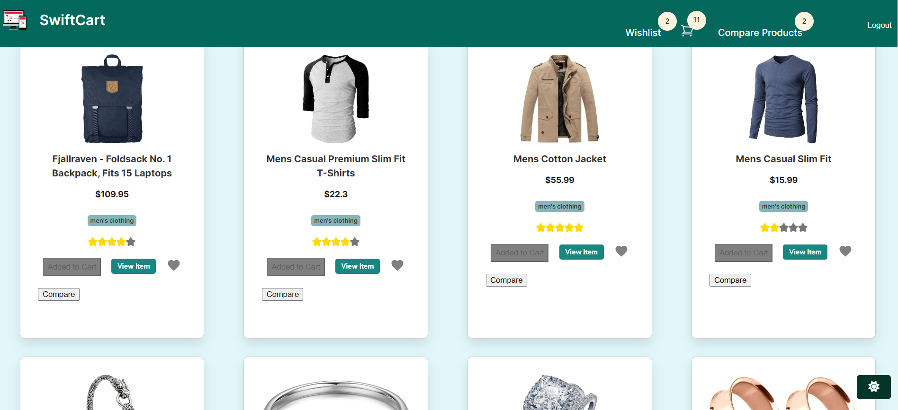
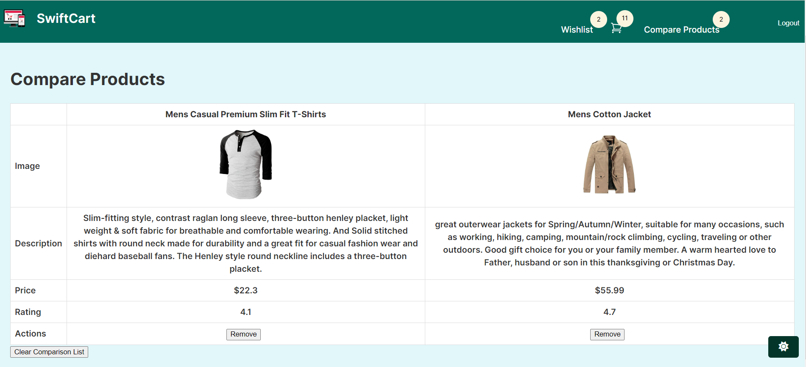
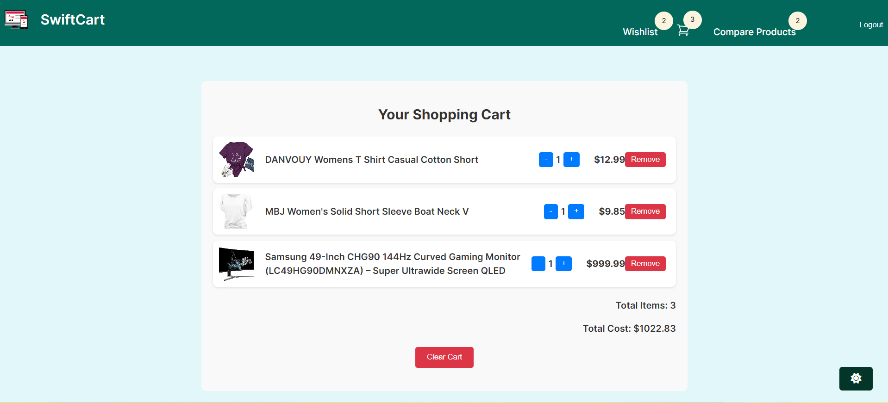
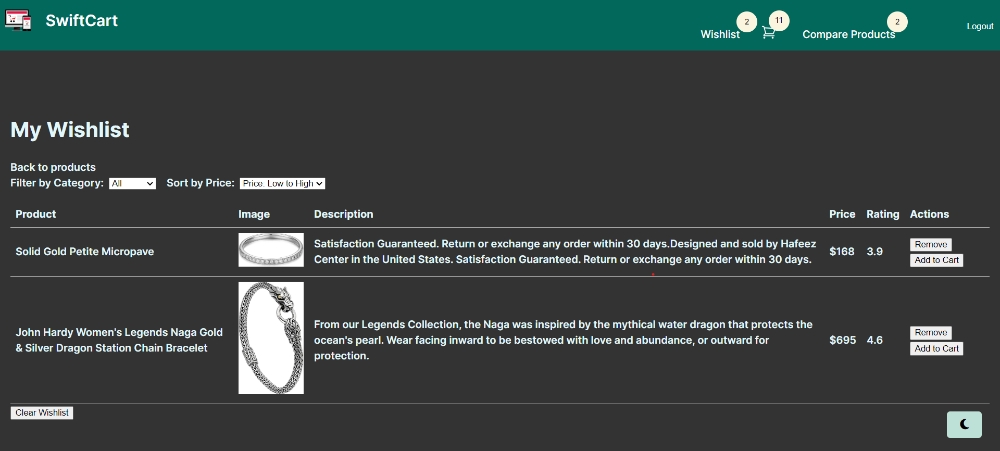

# Vue 3 SwiftCart







Vue 3 SwiftCart is an e-commerce web application built with Vue 3. It allows users to browse products, filter them by category, and sort them by price. The application features a responsive design and a skeleton loading state for improved user experience during data fetching.

## Features

- **Product Listing**: Displays a grid of products fetched from an API.

- **Category Filter**: Allows users to filter products by category.

- **Sorting**: Enables sorting products by price in ascending or descending order.

- **Responsive Design**: Adapts to different screen sizes with a mobile-friendly layout.

- **Skeleton Loading**: Shows placeholder content while products are being loaded.

- **State Management**: Utilizes Vuex to manage the application's state, ensuring a centralized and reactive data flow for filtering, sorting, and product information.

- **API Integration**: Fetches product data from a mock API for demonstration purposes.

- **Wishlist Management**: Users can add products to a wishlist by clicking a heart icon. The wishlist state is managed via Vuex and persists across sessions.

- **Login & Authentication**: Allows users to log in via the FakeStoreAPI, with secure authentication using JWT. Users can only access and manage their cart and wishlist when logged in.

- **Cart Functionality**: Logged-in users can add products to their cart, update quantities, remove items, and view the total cost. The cart state is also managed via Vuex and persists in local storage.

- **Theme Toggle**: Users can switch between light and dark modes, with their preference saved across sessions.

## Technologies Used

- **Vue 3**: A progressive JavaScript framework for building user interfaces.
- **Vuex**: State management library for Vue.js applications.
- **Fetch API**: For making network requests to retrieve products and categories.
- **Vue Router**: For navigating between different views in the application.
- **JWT (JSON Web Token)**: Used for secure authentication, ensuring that only logged-in users can access certain features.
- **CSS**: Custom styling for a polished and responsive user interface.

## Usage Examples

### - **Browsing Products**

When you first visit the application, you will see a list of products displayed in a grid format. Each product card will show an image, title, price, and category.

### - **Filtering by Category**

To filter the products by category, use the dropdown menu labeled "Filter by Category" at the top of the page. Select a category from the list, and the product grid will update to show only the products that belong to the selected category.

### - **Sorting by Price**

To sort the products by price, use the dropdown menu labeled "Sort by Price" at the top of the page. You can choose to sort the products in ascending or descending order. The product grid will update to reflect your selection.

### - **Adding Products to the Wishlist**

Click the heart icon on any product card to add it to your wishlist. The heart icon will turn red to indicate that the product is in your wishlist. You can view and manage your wishlist from the wishlist page.

### - **Cart Management**

Add products to your cart, update the quantity, or remove items directly from the product grid or product detail view. Your cart is accessible from any view in the app and updates in real-time as you make changes.

### - **Theme Toggle**

Switch between light and dark modes using the theme toggle button located at the top right corner of the page. Your theme preference will be saved and applied across sessions.

### - **Responsive Design**

The application is designed to be responsive and will adapt to different screen sizes. On smaller screens, the layout will adjust to ensure a smooth user experience.

### - **Skeleton Loading State**

While the products are being fetched from the API, a skeleton loading state will be displayed. This provides visual feedback to the user that the data is being loaded.

## Installation

To set up the project locally, follow these steps:

### Prerequisites

- **Node.js** (version 12.x or higher)
- **npm** (version 6.x or higher) or **yarn** (version 1.22.x or higher)

### Steps

1. **Clone Repository**:

   ```bash
   git clone https://github.com/OmphileMorwane/Module_2_OMPMOR404_JSE2407_Group-b_Omphile-Morwane_JSF04.git

   - terminal: npm install
   then
   - npm run dev
   ```


Video presentation link: https://youtu.be/GNHU56MUm-M